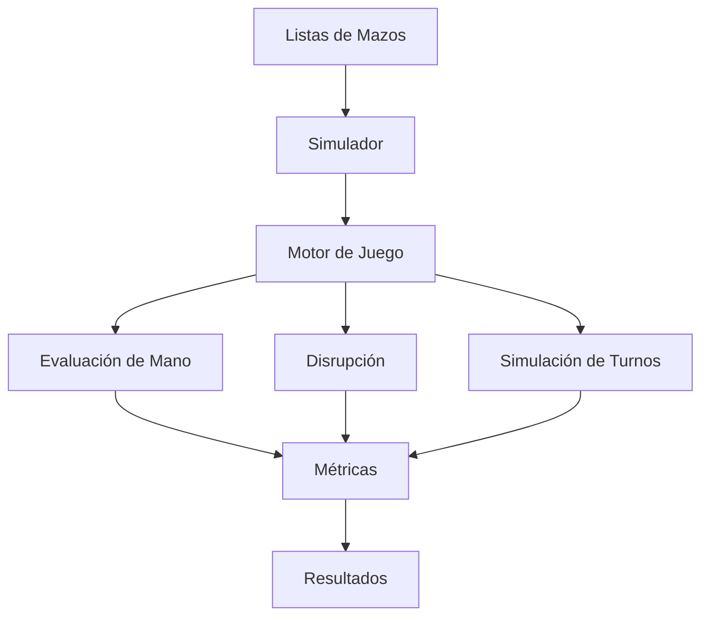
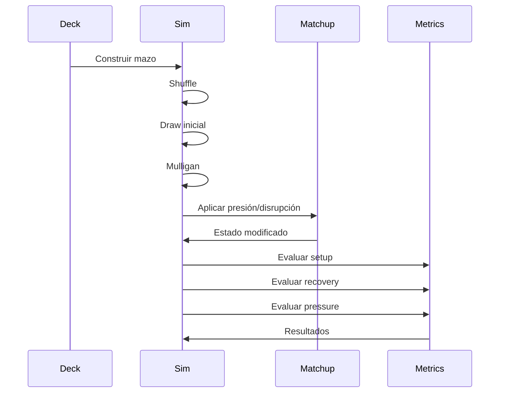
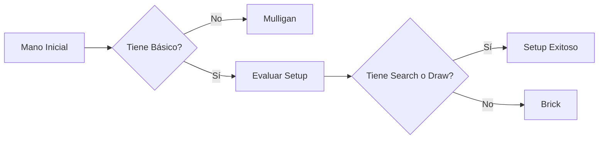
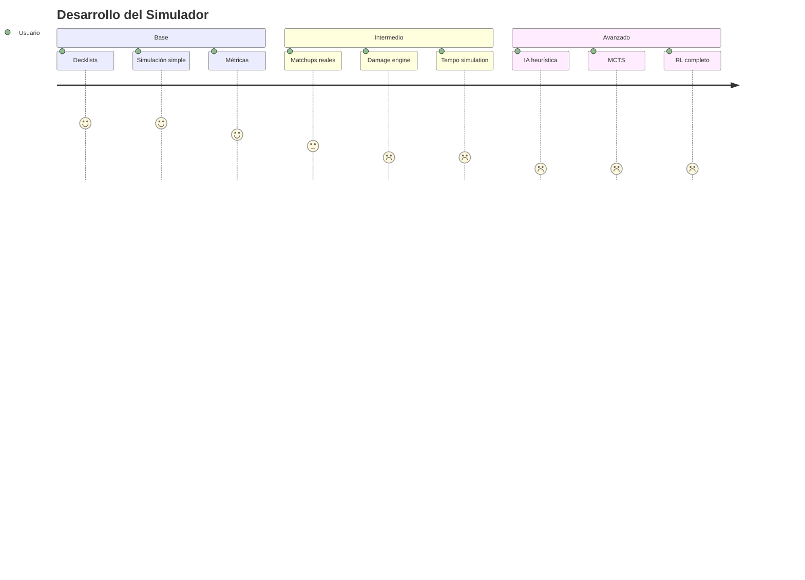

# Pokémon TCG Monte Carlo Simulator

Simulador estadístico para analizar consistencia, recuperación y presión en mazos de Pokémon TCG utilizando simulaciones tipo Monte Carlo.

El objetivo principal del proyecto es comparar listas competitivas y medir objetivamente:

- Setup inicial
- Setup optimo
- Brick rate
- Recovery rate
- Presión temprana
- Impacto de techs
- Performance contra arquetipos específicos (Futuro)

---

# Objetivo del Proyecto

Este proyecto busca crear un entorno flexible para:

- Comparar listas competitivas
- Evaluar cambios de pocas cartas
- Simular matchups
- Medir consistencia
- Experimentar con IA heurística (Futuro)
- Escalar a simulaciones más avanzadas (Futuro)

Actualmente el enfoque está en:

- N's Zoroark ex, con 2 verciones principales en mente:
    - Mega Lopunny ex
    - Cornerstone Mask Ogerpon ex

- Matchups contra Team Rocket, Mega Venusaur y Mega Lucario (Futuro)

---

# Estructura del Proyecto

```txt
pokemon_tcg_sim/
│
├── main.py
├── listas.py
├── sim.py
├── utilidades.py
│
├── matchups/ (Futuro)
│   ├── rocket.py
│   ├── venusaur.py
│   └── lucario.py
│
├── ai/ (Futuro)
│   └── heuristics.py
│
├── metrics/ (Futuro)
│   └── metrics.py
│
└── README.md
```

---

# Arquitectura del Sistema



---

# Flujo de una Simulación



---

# Métricas Implementadas

## Setup Rate

Probabilidad de abrir una mano funcional.

Ejemplo:
- Básico + buscador
- Básico + soporte de robo

---

## Setup Rate Optimo:

Probabilidad de abrir una mano optima y favorable.

Ejemplo:
- Básico Optimo + buscador + energia
- Básico + buscador + energia + soporte de robo

---

## Recovery Rate

Probabilidad de recuperarse luego de una disrupción.

Ejemplos:
- Judge
- Unfair Stamp
- Hand reset

---

## Pressure Rate

Probabilidad de:
- setear
- y además devolver presión

Ejemplos:
- Judge temprano
- Unfair Stamp
- ataque temprano
- estadios (Futuro)

---

# Ejemplo de Resultado

```python
{
    "setup_rate": 0.81,
    "recovery_rate": 0.63,
    "pressure_rate": 0.42
}
```

---

# Cómo Ejecutar

## Requisitos

- Python 3.11+
- VSCode recomendado

---

## Ejecutar simulación

```bash
python main.py
```

---

# Ejemplo de Uso

```python
from listas import (
    lopunny_deck_lillie,
    ogerpon_deck
)

from sim import run


print(run(lopunny_deck_lillie))
print(run(ogerpon_deck))
```

---

# Lógica Actual de Evaluación



---

# Categorías de Cartas

Actualmente el simulador clasifica cartas en:

- Pokémon básicos
- Evoluciones
- Search
- Draw
- Recovery
- Utility
- Disruption
- Stadiums
- Energy

---

# Posibles Mejoras Futuras

## Motor de Juego Completo

- Bench real
- Prize cards
- Damage system
- Evoluciones reales
- Estados especiales

---

## IA Heurística

Sistema de decisiones automáticas:

```python
if "Lillie" in hand:
    play("Lillie")
```

---

## Monte Carlo Tree Search (MCTS)

Permitir que la IA:
- explore jugadas
- compare líneas
- optimice decisiones

---

## Reinforcement Learning

Posible integración con:

- Gymnasium
- Stable-Baselines3
- PyTorch

---

# Ideas de Matchups

## Team Rocket
- Disrupción
- Debilidad Planta
- Setup rápido

## Mega Venusaur
- Alto HP
- Matchup de daño

## Mega Lucario
- Presión agresiva
- Tempo rápido

---

# Documentación Recomendada

## Docstrings

Ejemplo:

```python
def evaluate_setup(hand):
    """
    Evalúa si una mano inicial es funcional.

    Parameters
    ----------
    hand : list
        Lista de cartas en mano.

    Returns
    -------
    tuple
        (setup, pressure)
    """
```

---

# Tipado Recomendado

```python
def draw(deck: list[str], n: int) -> list[str]:
```

---

# Logging Recomendado

Agregar logs para debug:

```python
print(f"Hand: {hand}")
print(f"Recovery: {recovery}")
```

o usar:

```python
import logging
```

---

# Testing Recomendado

Usar:

```txt
tests/
```

Ejemplo:

```python
def test_has_basic():
    hand = ["Zorua", "Energy"]

    assert has_basic(hand) is True
```

---

# Roadmap



---

# Ideas de Investigación

- ¿Qué tech mejora más el recovery rate?
- ¿Cuántos buscadores necesita Zoroark?
- ¿Cuál es el costo real de jugar más energías?
- ¿Qué porcentaje de manos son "jugables"?
- ¿Cómo afecta Judge a cada arquetipo?